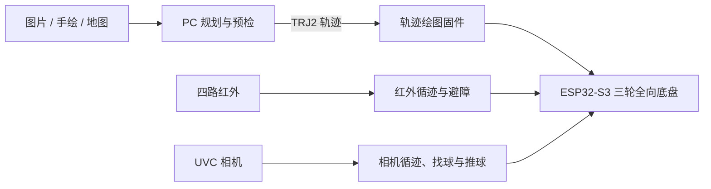

# Trace Motion（追迹）

Trace Motion（追迹）是一套机器人软件与固件项目：使用 PC 端工具生成、预览和校验二维轨迹，再由 ESP32-S3 三轮全向底盘执行。仓库同时保留红外循迹与相机视觉循迹找球两项独立任务，覆盖传感器、运动控制、视觉和任务状态机。



## 项目内容

| 部分 | 内容 | 状态 |
| --- | --- | --- |
| `pc/` | Python 轨迹规划、TRJ2 编解码、图像线稿处理、地图 UI、预览与 PC—ESP32 通信 | 已具备自动化测试 |
| `firmware/apps/trajectory-drawing/` | TRJ2 上传、轨迹预检、绘图执行与编译期安全档 | 可构建参考应用 |
| `firmware/apps/line-infrared/` | 四路红外循迹、超声避障、里程计与 OLED 状态显示 | 独立应用，待实机构建验收 |
| `firmware/apps/line-ball-camera/` | UVC 相机循迹、彩球识别、避障、找球与推球 | 实验导入，待补齐构建依赖 |
| `firmware/components/` | 未来可跨任务复用的底盘、传感器与协议组件 | 规划中 |

`N3` 是仓库当前的内部通信协议和源码模块名称；对外产品名称为 **Trace Motion（追迹）**。

## 快速开始

### PC 端：生成并校验轨迹

需要 Python 3.10 或更高版本。以下命令在 PowerShell 中执行：

```powershell
cd pc
python -m venv .venv
.\.venv\Scripts\python.exe -m pip install -e ".[dev]"
.\.venv\Scripts\python.exe -m pytest -ra
```

将线稿图片转换为 TRJ2 轨迹：

```powershell
.\.venv\Scripts\python.exe -m pc_trajectory.cli lineart graph\image.png `
  --output output --max-extent-mm 100 --threshold 127 `
  --min-component-pixels 80 --simplify-mm 0.35
```

可选依赖：`.[raster]` 用于图像线稿处理，`.[demo]` 用于相机和地图演示，`.[serial]` 用于 USB 串口通信。

### ESP32-S3：轨迹绘图应用

安装 ESP-IDF 5.4.4 后，在已加载 ESP-IDF 环境的 PowerShell 中执行：

```powershell
cd firmware\apps\trajectory-drawing
idf.py set-target esp32s3
idf.py build
idf.py -p COMx flash monitor
```

默认构建是安全档：支持连接、上传、校验以及 `PEN_UP`、`PEN_DOWN`、`WAIT` 事件，但不会驱动电机或笔机构。硬件运动必须在通过急停、电源、方向和空载验收后，显式开启对应构建参数。

```powershell
idf.py -B build-sim -D N3_ENABLE_SIMULATION=1 build
```

Wi-Fi 默认关闭。启用时请传入自己的热点名称和强密码，仓库中的值仅为开发占位符：

```powershell
idf.py -B build-wifi -D N3_ENABLE_WIFI=1 `
  -D N3_WIFI_AP_SSID="你的热点名称" `
  -D N3_WIFI_AP_PASSWORD="至少 8 位的私有密码" build
```

### 红外循迹应用

```powershell
cd firmware\apps\line-infrared
idf.py set-target esp32s3
idf.py build
```

在刷写前，先根据实际接线检查 `main/infrared_sensor.h` 的引脚定义；该应用的轮径、PID、避障距离和红外逻辑均需要结合实车标定。

### 相机循迹找球应用

`firmware/apps/line-ball-camera/` 包含完整任务源码，但尚缺原始工程未随代码包提供的 ESP-IDF 依赖锁定与构建配置。它依赖 UVC、JPEG 解码、HTTP 服务、Wi-Fi、SPIFFS 和语音播放。请先完成这些依赖、引脚配置与实机安全验收，再作为可刷写应用使用。

## 安全说明

- 初次运行任何固件时，请让驱动轮悬空或清空周边区域。
- 确认 Stop 或 E-Stop 能切断运动输出后，再进行地面测试。
- PC 端预检用于尽早发现错误；ESP32 端的长度、CRC32、TRJ2 格式和构建能力校验才是执行许可的最终依据。
- 不要将示例 Wi-Fi 参数、调试凭据或生成的构建目录提交到仓库。

更多操作说明见 [实机使用说明](docs/TRACE_MOTION_ROBOT_USER_GUIDE.md)。

## 目录与模块边界

```text
pc/                         PC 端轨迹和视觉工具
firmware/
├─ apps/                    三个独立 ESP-IDF 应用
├─ components/              稳定公共组件的规划区
└─ README.md                固件应用说明
docs/                       架构、模块边界和使用说明
archive/                    历史实验与阶段性开发记录
```

同名代码不会自动视为公共组件。当前红外和相机任务的 `line_tracker`、`obstacle_avoid`、运动控制与传感器实现存在差异，必须在 API、配置和测试收敛后才会移动到 `firmware/components/`。详见 [固件模块边界](docs/FIRMWARE_MODULE_MAP.md)。

## 许可证

除另有说明的第三方依赖外，本仓库按 [Apache License 2.0](LICENSE) 发布。该许可证允许使用、修改、分发和商用，并包含专利授权条款；分发修改版本时须保留许可证和通知。项目名称与标识的使用不由本许可证授予。

## 文档

- [系统架构](docs/TRACE_MOTION_ARCHITECTURE.md)
- [固件应用说明](firmware/README.md)
- [固件模块边界](docs/FIRMWARE_MODULE_MAP.md)
- [实机使用说明](docs/TRACE_MOTION_ROBOT_USER_GUIDE.md)
- [归档内容说明](archive/README.md)
