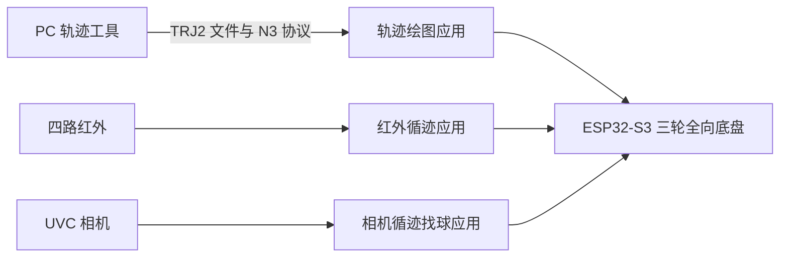

# Trace Motion（追迹）

Trace Motion（追迹）是一套基于 ESP32-S3 三轮全向底盘的机器人软件项目。它包含 PC 端轨迹工具，以及轨迹绘图、红外循迹避障和相机循迹找球三项固件任务。



## 仓库结构

```text
pc/                         Python 轨迹规划、TRJ2 工具和 PC—ESP32 通信
firmware/
├─ apps/                    独立 ESP-IDF 应用
│  ├─ trajectory-drawing/   TRJ2 上传、校验和轨迹执行
│  ├─ line-infrared/        红外循迹与超声避障
│  └─ line-ball-camera/     相机循迹、找球与推球源码
├─ components/              可复用的 ESP-IDF 公共组件
├─ tests/                   底盘标定和硬件验收程序
└─ README.md                固件构建和组件说明
docs/                       架构、模块边界和实机操作说明
archive/                    不参与发布构建的历史材料
```

`N3` 是 PC 与轨迹绘图固件之间使用的内部协议和模块名称；对外名称为 **Trace Motion（追迹）**。

## PC 端：生成和校验轨迹

需要 Python 3.10 或更高版本：

```powershell
cd pc
python -m venv .venv
.\.venv\Scripts\python.exe -m pip install -e ".[dev]"
.\.venv\Scripts\python.exe -m pytest -ra
```

将线稿转换为 TRJ2 文件：

```powershell
.\.venv\Scripts\python.exe -m pc_trajectory.cli lineart graph\image.png `
  --output output --max-extent-mm 100 --threshold 127 `
  --min-component-pixels 80 --simplify-mm 0.35
```

## ESP32-S3 固件

安装 ESP-IDF 5.4.4 并加载环境后，从目标应用目录构建。

### 轨迹绘图

```powershell
cd firmware\apps\trajectory-drawing
idf.py set-target esp32s3
idf.py build
idf.py -p COMx flash monitor
```

默认是安全档：可连接、上传、校验和执行事件轨迹，不会驱动电机或笔机构。硬件功能须通过构建参数显式启用，并先完成急停、电源、轮向和空载检查。

```powershell
idf.py -B build-sim -D N3_ENABLE_SIMULATION=1 build
```

Wi-Fi 默认关闭。启用时必须在构建命令中提供私有热点名称和密码：

```powershell
idf.py -B build-wifi -D N3_ENABLE_WIFI=1 `
  -D N3_WIFI_AP_SSID="你的热点名称" `
  -D N3_WIFI_AP_PASSWORD="至少 8 位的私有密码" build
```

### 红外循迹与避障

```powershell
cd firmware\apps\line-infrared
idf.py set-target esp32s3
idf.py build
```

刷写前请按实际车辆检查 `tm_sensors`、`tm_chassis` 和 `tm_line_ir` 中的引脚、轮径、PID 与避障距离配置。

### 相机循迹找球

`firmware/apps/line-ball-camera/` 提供任务源码，依赖 UVC、JPEG 解码、HTTP 服务、Wi-Fi、SPIFFS 和语音播放。该应用尚未提供可复现的 ESP-IDF 工程配置；补齐依赖、板级配置与实机验收后再进行构建和刷写。

## 公共组件

`firmware/components/` 是 ESP-IDF 组件目录。轨迹绘图和红外循迹工程会通过 `EXTRA_COMPONENT_DIRS` 自动加载它。组件职责和依赖关系见 [公共组件说明](firmware/components/README.md)。

## 安全说明

- 首次运行任何固件时，使驱动轮悬空或清空周边区域。
- 在确认 Stop 或 E-Stop 能切断运动输出前，不要进行地面测试。
- PC 端预检用于提前发现问题；ESP32 的格式、长度、CRC32 和运行时安全校验才决定是否执行。
- 不要提交热点密码、调试凭据、构建目录或生成的依赖目录。

## 文档

- [固件说明](firmware/README.md)
- [公共组件说明](firmware/components/README.md)
- [固件测试说明](firmware/tests/README.md)
- [硬件配置与标定指南](docs/HARDWARE_CALIBRATION.md)
- [系统架构](docs/TRACE_MOTION_ARCHITECTURE.md)
- [模块边界](docs/FIRMWARE_MODULE_MAP.md)
- [实机操作说明](docs/TRACE_MOTION_ROBOT_USER_GUIDE.md)
- [归档内容说明](archive/README.md)

## 许可证

除另有说明的第三方依赖外，本仓库按 [Apache License 2.0](LICENSE) 发布。该许可证允许使用、修改、分发和商用，并包含专利授权条款；分发修改版本时须保留许可证和通知。项目名称与标识的使用不由本许可证授予。

## 维护团队

Trace Motion（追迹）由「鼠舒我呀消一下蒜鸟」维护。成员与角色见 [AUTHORS.md](AUTHORS.md)。
