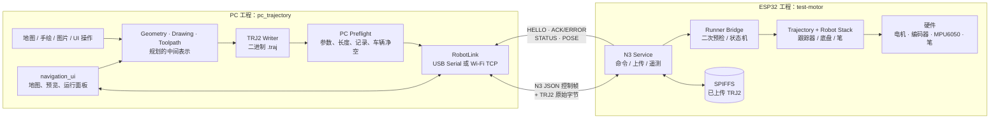
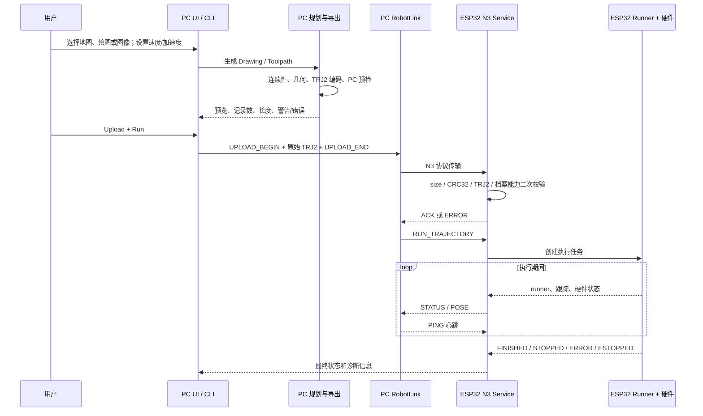
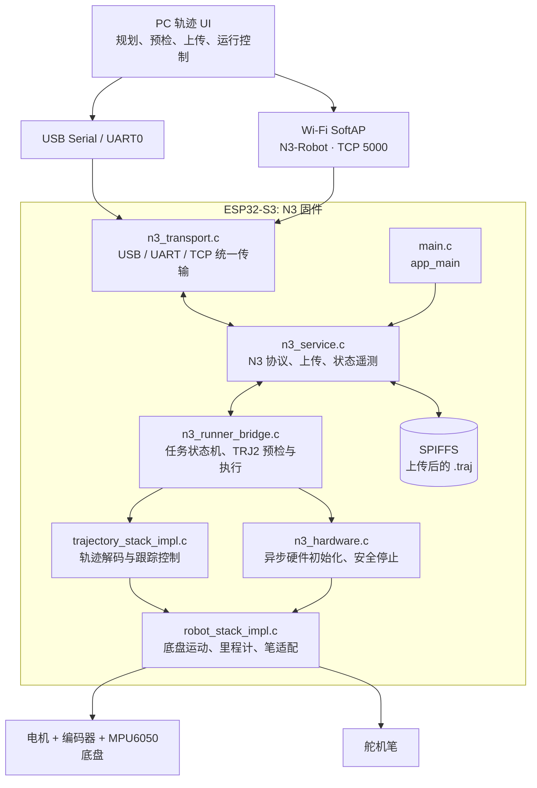
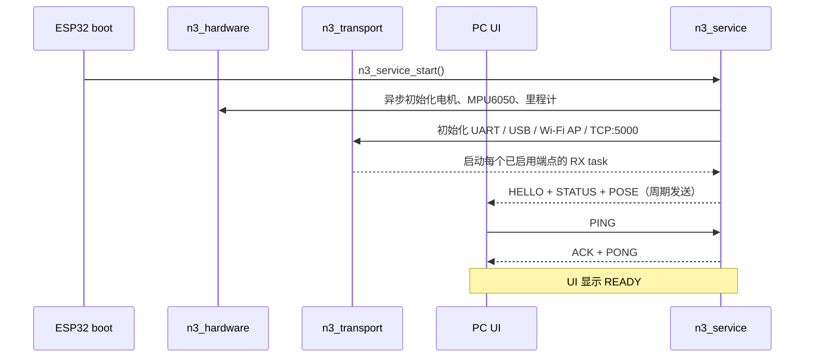
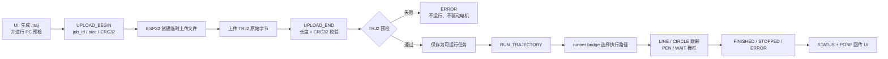
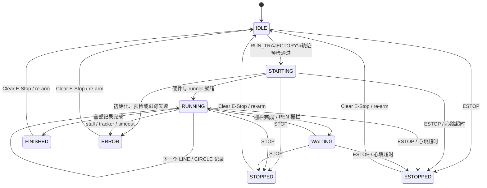

# N3 联合工程结构与运行原理

N3 系统由两个独立工程组成，二者通过 **TRJ2 轨迹文件** 与 **N3 通信协议** 对接。本文描述系统职责和协议边界；构建和安全状态请以根目录 README 与当前源代码为准。

| 工程 | 位置 | 角色 |
| --- | --- | --- |
| PC 规划端 | `pc/` | 将地图、手绘、图片或路径操作编译为 TRJ2；负责可视化、预检、上传和任务控制。 |
| ESP32 执行端 | `firmware/` | 接收并二次校验 TRJ2；驱动底盘和笔，处理硬件安全，并持续回传状态。 |

本文以两端联合作为唯一视角。日常操作请看 [N3_ROBOT_USER_GUIDE.md](N3_ROBOT_USER_GUIDE.md)。

## 1. 两端总览



**边界原则：** PC 决定“要画/走什么”，ESP32 决定“现在能否安全执行、如何驱动硬件”。因此 PC 的预检用于尽早提示，而 ESP32 的预检和安全状态机才是最终执行许可。

## 2. 跨工程运行流程



## 3. PC 工程结构（`pc_trajectory`）

```text
pc_trajectory/
├─ pc_trajectory/
│  ├─ geometry.py, drawing.py, path_analysis.py
│  │    数学几何、笔画、长度/连续性分析
│  ├─ toolpath.py, toolpath_compiler.py
│  │    执行中间表示；Drawing → Motion / PEN / WAIT
│  ├─ traj2_format.py, traj2_reader.py, traj2_writer.py, traj2_validate.py
│  │    TRJ2 的唯一二进制格式定义、读写与严格校验
│  ├─ toolpath_trj2_export.py
│  │    Toolpath → TRJ2（LINE / CIRCLE / PEN / WAIT）
│  ├─ raster/
│  │    图片预处理、骨架化、笔画追踪、简化和圆弧拟合
│  ├─ demo/
│  │    地图模型/规划、车辆净空、协议、RobotLink、仿真和预检
│  ├─ navigation_ui.py
│  │    主地图 UI、轨迹预览、真实小车连接与控制面板
│  ├─ ui.py, camera_calibration_ui.py
│  │    图片线稿与相机纸面标定界面
│  └─ cli.py
│       无界面导出、线稿处理命令入口
├─ examples/
│  ├─ generate_*              可复现轨迹与验收夹具生成
│  └─ accept_n3_*             面向真实 ESP32 的串口验收脚本
├─ tests/                     PC 模块、格式、协议、规划单元测试
├─ CURVE_PLANNING_DESIGN.md   曲线规划后续设计
└─ N3_SETTINGS_AND_ESP32_HANDOFF.md
    PC/ESP32 参数与交接记录
```

### 3.1 PC 内部数据模型


- `geometry.py` 描述线、圆弧、三次贝塞尔等纯数学几何；不包含电机参数。
- `toolpath.py` 将“几何”与“怎样执行”分离，`Motion` 携带速度和加速度，笔状态由 `PEN_UP/PEN_DOWN` 事件管理。
- `toolpath_compiler.py` 负责将 `Drawing/Stroke` 组织成连续、可执行的 Toolpath，并插入必要的抬笔、落笔和空走段。
- `toolpath_trj2_export.py` 负责降低为 TRJ2。当前量产 ESP32 档案只执行 `LINE/CIRCLE/PEN/WAIT`；PC 的 `CubicBezier` 是上层表达能力，不能直接作为当前硬件任务输出。
- `traj2_format.py` 是 PC 端 TRJ2 二进制布局的唯一来源。ESP32 端以兼容的 C 解码器二次读取同一格式。

### 3.2 PC 与 ESP32 的稳定接口

| 接口 | PC 端责任 | ESP32 端责任 | 当前约束 |
| --- | --- | --- | --- |
| WORLD 坐标 | 用毫米构建和预览路径 | 用同一坐标系跟踪并回传 POSE | `+X` 为 yaw=0 时车头方向，`+Y` 为左，正角为 CCW |
| TRJ2 文件 | 编码 header 与记录，先做格式/几何预检 | 解码并再次校验后才执行 | header 32 bytes；每条记录 44 bytes |
| 运动记录 | 输出 LINE/CIRCLE 及速度、加速度 | 执行当前构建档案允许的记录 | 默认 100 mm/s；最低可靠速度 >25 mm/s；最高 250 mm/s |
| 事件记录 | 输出 PEN_UP、PEN_DOWN、WAIT | 控制笔并等待稳定时间 | 笔无位置反馈，状态表示命令已发出并已等待 |
| 控制协议 | 发送带 `id` 的 JSON 命令，等待 ACK/ERROR | 校验命令、缓存响应、汇总状态 | JSON 以换行分帧；上传正文是原始二进制 |
| 安全 | UI 显示警告，保持 PING 心跳，提供 Stop/E-Stop | 最终停止权限、心跳超时锁定、硬件急停 | ESP32 拒绝不安全或不支持的任务 |

这张表是后续加入“指定点旋转”或贝塞尔曲线时必须共同更新的契约：先扩展 PC 的中间表示与导出，再扩展固件的严格解码、预检和状态机，不能只改其中一端。

## 4. ESP32 执行端结构（`test-motor`）



PC 只需要面对 N3 协议；USB 与 Wi-Fi 是等价传输层。ESP32 接收、校验并保存轨迹，随后由固件独立执行和持续上报状态。

## 5. ESP32 实际参与构建的文件

工程 `main/` 中保留了不少早期电机和传感器实验文件，但当前量产 N3 固件只由 [main/CMakeLists.txt](main/CMakeLists.txt) 显式列出的下列源文件构建。不要把历史测试文件误当成刷写入口。

```text
test-motor/
├─ CMakeLists.txt                    ESP-IDF 工程入口
├─ N3_ROBOT_USER_GUIDE.md            日常使用说明
├─ N3_ARCHITECTURE.md                本文
├─ main/
│  ├─ CMakeLists.txt                 构建开关、组件依赖、实际编译清单
│  ├─ main.c                         当前链接入口；app_main 启动 N3 service
│  ├─ n3_app.c                       与 main.c 同功能的历史入口副本；后续应合并删除
│  ├─ n3_build_config.h              构建档案与功能组合约束
│  ├─ n3_service.c/.h                N3 协议、上传、ACK、遥测、RX 任务
│  ├─ n3_transport.c/.h              UART0、USB Serial/JTAG、Wi-Fi TCP
│  ├─ n3_runner_bridge.c/.h          轨迹预检、执行任务、状态机、心跳保护
│  ├─ n3_hardware.c/.h               电机/MPU/里程计初始化与硬件急停
│  ├─ n3_motion.c/.h                 独立 ROTATE_REL 验收档案
│  ├─ trajectory_stack_impl.c        TRJ2 解码、LINE/CIRCLE 跟踪器适配
│  ├─ robot_stack_impl.c             底盘、里程计、笔等低层适配
│  ├─ trajectory_*.h                 轨迹格式、runner、tracker 接口
│  ├─ chassis_*.h                    底盘运动学、运动和里程计接口
│  └─ PROJECT_HANDOFF_CURRENT_STATUS.md 详细开发交接记录
├─ spiffs/                           刷写到 ESP32 文件系统的资源
└─ build-circle/                     当前 motion-circle-pen 构建产物
```

## 6. ESP32 上电与连接流程



Wi-Fi 档案中，ESP32 建立 `N3-Robot` 热点，并监听 `192.168.4.1:5000`。最多连接一个 TCP 客户端；新客户端会替换旧客户端。USB 不需要断开，适合作为调试备用通道。

## 7. ESP32 上传与执行流程

`.traj` 是 TRJ2 二进制轨迹。控制消息是以换行分隔的 JSON；上传正文为指定长度的原始二进制字节。上传期间由当前传输端点独占接收正文，避免 JSON 与二进制混淆。



关键校验包括：文件大小、CRC32、TRJ2 结构、支持的记录类型、速度/加速度、路径长度、圆弧半径、连续性与当前构建档案允许的功能。校验失败不会触发运动。

## 8. ESP32 运行时状态机



`STOP` 是受控停止；`ESTOP` 和传输心跳超时会锁定安全状态。任务结束、出错或停止后，使用 UI 的 **Clear E-Stop / re-arm** 回到 `IDLE`，不需要按板载 Reset。

## 9. ESP32 模块功能与职责

| 模块 | 主要职责 | 不负责的内容 |
| --- | --- | --- |
| `main.c` | 当前生产固件入口；调用 `n3_service_start()` | 不处理协议和运动细节 |
| `n3_service` | N3 JSON 命令、上传会话、CRC32、ACK/ERROR、HELLO/STATUS/POSE | 不直接驱动电机 |
| `n3_transport` | 多端点字节收发与 Wi-Fi TCP listener | 不解释 N3 或 TRJ2 内容 |
| `n3_runner_bridge` | 轨迹预检、执行任务创建、记录推进、状态汇总、超时/心跳保护 | 不直接实现电机 PID |
| `trajectory_stack_impl` | TRJ2 解码、LINE/CIRCLE 目标轨迹、跟踪器配置 | 不管理网络和上传 |
| `robot_stack_impl` | 将速度命令映射到底盘/笔硬件接口，读取姿态与轮速 | 不决定高层任务顺序 |
| `n3_hardware` | 后台初始化电机、MPU6050、里程计，提供 reset pose / estop | 不解析 `.traj` |
| `n3_motion` | ROTATE_REL 单项硬件验收档案 | 当前不与完整运动轨迹档案组合 |
| `n3_build_config` | 编译期功能许可与不兼容组合检查 | 不提供运行期切换开关 |

> 注意：`main.c` 与 `n3_app.c` 当前都定义了相同的 `app_main()` 实现。ESP-IDF 静态库链接目前选择 `main.c`，所以运行结果一致；这不是理想结构。后续整理时应保留一个入口并从 `main/CMakeLists.txt` 移除另一个，避免未来两份入口逻辑发生漂移。

## 10. 当前构建档案

当前 `build-circle` 使用的目标档案是 `motion-circle-pen`：

| 功能 | 状态 | 说明 |
| --- | --- | --- |
| 硬件初始化 | 启用 | 电机、MPU6050、里程计 |
| LINE | 启用 | 完整路径执行 |
| CIRCLE | 启用 | 完整路径执行 |
| PEN_UP / PEN_DOWN / WAIT | 启用 | 笔无位置反馈，因此状态代表已发出且已等待完成的指令 |
| Wi-Fi TCP | 启用 | 由 `build-circle` 的 `N3_ENABLE_WIFI=1` 配置决定 |
| USB / UART | 启用 | 与 Wi-Fi 并存 |
| ROTATE_REL 单项验收 | 未并入该档案 | 当前是独立安全验收档案，后续应统一进完整路径状态机 |
| 仿真 | 未启用 | 与硬件运动档案互斥 |

编译期开关位于 `main/CMakeLists.txt`。这是一项安全设计：不会通过网络命令在运行中突然开启未编译的硬件能力。

## 11. 运动、笔和安全约束

- 最低可靠线速度：大于 `25 mm/s`；UI 默认速度为 `100 mm/s`，上限 `250 mm/s`。
- 正常直线建议至少 `150 mm`；正常圆弧建议半径至少 `100 mm`。这两项是运行质量建议，预检会提示较小路径。
- 轨迹执行以里程计和 MPU6050 的姿态融合为反馈；状态中可读取参考点、跟踪误差、轮速目标/实际值与 stall 信息。
- 笔电机没有位置反馈。固件按设定脉冲发出动作并等待预设稳定时间，再推进下一个记录；它不能证明笔尖机械上一定到达指定位置。
- 传输心跳丢失、轮子 stall、跟踪器错误、执行超时都会停止驱动并报告明确的 `runner_error` / `error`。

## 12. 后续扩展建议

1. **指定点旋转**：将旋转定义为 TRJ2 中的路径记录，而不是继续依赖独立 `ROTATE_REL` 档案；由同一 runner 负责预检、栅栏、心跳和恢复。
2. **曲线规划**：PC 侧先把贝塞尔或样条离散/拟合为连续的 LINE/CIRCLE，再以 TRJ2 上传。固件应保持记录执行器简单、可验证。
3. **Wi-Fi STA 模式**：若需要接入局域网，在 SoftAP 稳定后增加显式配置的 STA 模式；不要把路由器凭据硬编码进固件。
4. **笔校准**：为 UP/DOWN 脉冲和稳定时间提供配置文件或 UI 校准页；仍应保留“无反馈”的状态语义。

## 13. 跨工程快速定位问题

| 症状 | 首先查看 | 常见处置 |
| --- | --- | --- |
| UI 无法 READY | `HELLO`、`N3 transport ready` 日志 | 核对 COM、Wi-Fi、`192.168.4.1:5000` |
| 上传失败 | UI Preflight 与 `UPLOAD_*` 的 ERROR | 根据 CRC、长度、记录或参数提示修轨迹 |
| 小车不动 | `motion_ready`、`estop`、`runner_error` | 检查硬件初始化，执行 Clear E-Stop / re-arm |
| 中途停止 | `runner_error`、轮速/stall 字段、心跳状态 | 检查电源、轮胎接地、Wi-Fi 链路与参数 |
| 任务后不能再运行 | `runner` 是否为 terminal state | 点击 Clear E-Stop / re-arm，不按板载 Reset |
| Wi-Fi 有热点但端口拒绝 | 串口中的 Wi-Fi TCP listener 日志 | 确认刷写 `build-circle`，检查 `errno` |
