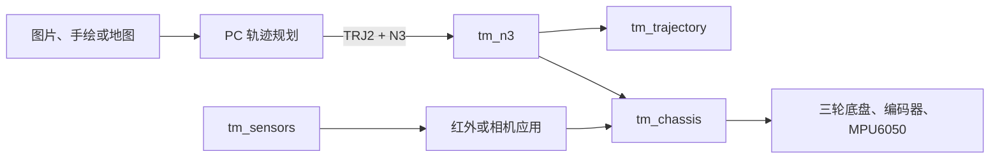

# Trace Motion（追迹）系统架构

Trace Motion 由 PC 端轨迹工具和 ESP32-S3 固件组成。PC 端负责生成、预览和预检轨迹；ESP32 端负责接收、再次校验、执行和安全停止。

## PC 与固件的接口

| 接口 | PC 端 | ESP32 端 |
| --- | --- | --- |
| TRJ2 文件 | 生成、格式预检和上传 | 长度、CRC32、格式和执行能力复检 |
| N3 协议 | 发送命令、上传轨迹、读取状态 | 处理命令、保存轨迹、回传状态 |
| 坐标与运动 | 以毫米规划路径 | 用底盘运动学、编码器和姿态信息执行 |
| 安全 | 显示预检和运行状态 | Stop、E-Stop、超时和硬件安全状态为最终许可 |

PC 的预检不能替代实机安全检查。固件默认采用安全构建档，硬件运动和 Wi-Fi 功能必须通过构建参数明确启用。

## 固件层次

- `firmware/components/`：可复用底盘、传感器、轨迹和 N3 组件。
- `firmware/apps/trajectory-drawing/`：TRJ2 绘图任务入口。
- `firmware/apps/line-infrared/`：红外循迹与避障任务入口。
- `firmware/apps/line-ball-camera/`：相机视觉任务源码，待补齐独立构建配置。

具体组件边界见 [FIRMWARE_MODULE_MAP.md](FIRMWARE_MODULE_MAP.md)。
