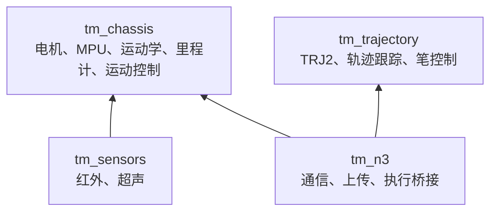

# Trace Motion ESP-IDF 公共组件

这里存放来源于 `test-motor` 基线工程、可由多个应用复用的底层实现。每个子目录都是一个标准 ESP-IDF 组件，公共头文件放在 `include/`，实现和依赖在该目录的 `CMakeLists.txt` 中声明。



| 组件 | 公开接口 | 说明 |
| --- | --- | --- |
| `tm_chassis` | `motor_control.h`、`mpu6050.h`、`chassis_*.h` | 三轮全向底盘的硬件抽象和闭环运动基础。 |
| `tm_sensors` | `infrared_sensor.h`、`ultrasonic_sensor.h` | 红外循迹输入和超声距离测量。 |
| `tm_trajectory` | `trajectory_*.h`、`pen_control.h` | TRJ2 格式、轨迹执行、跟踪器和笔控制接口。 |
| `tm_n3` | `n3_*.h` | N3 命令、上传、通信端点、硬件初始化和轨迹运行状态机。 |

## 在应用中使用

应用顶层 `CMakeLists.txt` 需要指向本目录：

```cmake
set(EXTRA_COMPONENT_DIRS
    "${CMAKE_CURRENT_LIST_DIR}/../../components/tm_chassis"
    "${CMAKE_CURRENT_LIST_DIR}/../../components/tm_sensors"
)
```

应用 `main/CMakeLists.txt` 再通过 `REQUIRES` 说明所需组件，例如：

```cmake
idf_component_register(SRCS "main.c" REQUIRES tm_chassis tm_sensors)
```

## 配置与边界

公共组件包含当前底盘和传感器的引脚、轮径、PID 与设备参数。使用不同板型或机械结构时，应先将这些参数抽为项目配置并完成台架验证。红外循线、相机循线、找球、推球和网页调试都是应用专用代码，不属于这些公共组件。

所有需要按实车修改的变量、测量方法和验证测试见 [硬件配置与标定指南](../../docs/HARDWARE_CALIBRATION.md)。
